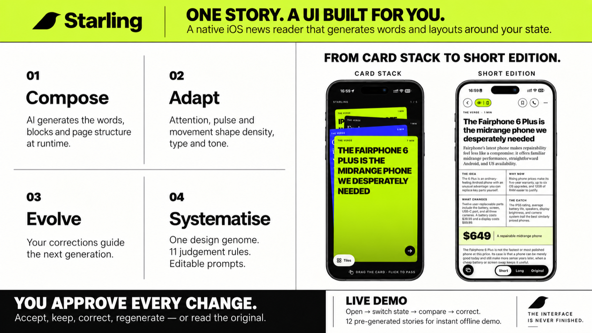

# Starling



**One story. A UI built for you.** A native iOS news reader that generates the words and the layout of every story around the person reading it, right now: their attention, pulse, movement, time of day, and the sources they chose.

Built in one day at the Architect x Corgi designathon (London, 6 September 2026) for the brief *"The interface is never finished"*. Repo: this one. Team: Luka Dadiani, with a teammate on the ruleset, and Claude Code doing the typing.

## For the judges

**What a static UI cannot do here.** The page you get for a story does not exist until you open it. The model returns an *Edition*: the rewritten text (density, tone, block structure) **and** the page design (layout archetype, typeface, palette, scale, format) chosen from a fixed genome, justified in one sentence you can read. Two readers, or one reader at two moments, get two different pages of the same story.

**How the brief maps**

| Brief | Where it is in Starling |
|---|---|
| **Compose** — generated live, not picked from a template | Every Edition is a fresh JSON spec rendered through the genome (`Starling/Generation/Edition.swift`, `DesignGenome.swift`). Five short-edition archetypes and an article layout; cards one and two are generated posters with the type in the image. |
| **Adapt** — per user, device, task, moment | ARKit gaze and blink → attention; Apple Watch or fingertip camera → pulse; CoreMotion → walking / posture; clock → time of day. All real hardware, fused into a state the prompt consumes. |
| **Evolve** — mutate through feedback, survivors stay | Keep, Regenerate, "Not how I feel" and the layout rules you edit are stored and injected into every later prompt. Regenerate is told the previous edition and must not repeat it. |
| **Systematise** — genome: fixed rules, variable expression | A closed vocabulary (palettes, typefaces, scales, blocks, layouts) the model must choose from; eleven rules of judgement; per-state layout rules editable in Settings. Anything outside the vocabulary is rejected by the schema. |
| **Demo live** | Everything runs on the phone in your hand. Twenty sample stories ship with pre-generated editions and 80+ posters so the first opens are instant and offline; every other story generates live. |
| **Show two generations** | Tap the pill → CALM / FOCUSED, or press Regenerate, or open Compare from the ellipsis. |
| **Human in control** | The page never swaps on its own. Adaptation is proposed; you switch, keep, correct, regenerate, or read the original. |

**Declared mocks and limits.** The twenty sample stories' editions and posters are pre-generated (same pipeline, run offline) so the demo does not depend on cafe wifi; nothing else is canned. Camera pulse shows "calibrating" until it is confident rather than a made-up number. The Apple Watch companion streams live heart rate when paired; the fingertip measurement is the phone-only path. The API keys are in the app for the demo; the production shape is the same calls from an edge function.

**Two-minute judge run-through**

1. Open a story from the tile home. You get a short edition with a stat callout and headed fact boxes, in the skin the model chose for your state.
2. Tap the bottom-left button for cards: generated posters first, then one idea per card.
3. Tap the state pill (top) → the raw telemetry, then CALM or FOCUSED to see the same story regenerated for another mood.
4. Ellipsis → Regenerate: a visibly different arrangement of the same system.
5. Tap the phone icon: Starling calls you, greets you by name, tells you the story in two sentences and hands over. Interrupt it.
6. Settings → Layout rules: type an instruction ("when I'm tense, only cards") and reopen a story.

**Novelty · Works · Shippable.** Structure, content and design exist only because they were generated for this person in this moment. A judge can complete every step above uncoached. The pipeline is a schema-constrained model call plus an image call, both cacheable per (story, state); the sensors are standard iOS APIs; an overnight pre-generation task already exists. Cost and latency are the honest open questions and they are on the ledger below.

## The generative ruleset

The model does not choose arbitrary styling. It chooses from a closed vocabulary (the *genome*), and every deviation from the default has to be justified in a one-sentence rationale shown to the reader.

### Genome: the vocabulary

**Text controls**

| Field | Values | Meaning |
|---|---|---|
| `density` | glance, brief, standard, longform | ≈20s, ≈60s, ≈3 min, full story |
| `tone` | brisk, plain, warm, reflective, reassuring | voice of the rewrite |
| `pace` | single, scroll | fits one screen or scrolls |
| `format` | text, cards | one flowing page, or one idea per swipeable card |
| `blocks` | headline, dek, keyFacts (≤3 items), paragraph, pullQuote, imageCard, timeline, takeaway, readFullPrompt | the only building blocks |

**Design controls**

| Field | Values | Rendered as |
|---|---|---|
| `typeScale` | compact, regular, large, xl | body 15 / 17 / 21 / 26pt with matching headline and leading |
| `typeface` | serif, sans, rounded, mono | New York, SF Pro, SF Rounded, SF Mono |
| `headlineWeight` | regular, semibold, black | |
| `palette` | dawn, day, focus, dusk, night, calm | fixed background / card / text / secondary colour sets and light-or-dark scheme |
| `accent` | amber, coral, sage, sky, slate, plum | key facts, pull-quote rule, cards, takeaway; each has a light and a dark variant |
| `margins` | tight, normal, wide | 14 / 22 / 34pt |

The schema is strict JSON: every field is required, enums only, `additionalProperties: false`, no recursion. Anything outside the vocabulary is rejected before it reaches the renderer. The full literal lives in `Starling/Generation/Edition.swift`; the colours and metrics in `Starling/Generation/DesignGenome.swift`.

### Rules of judgement (the system prompt)

These are sent verbatim as the system prompt, from `DesignGenome.rules`:

1. **The default is** standard / plain / scroll / regular / sans / semibold / day / slate / normal. **Every deviation must earn its place**: it must make the page clearer, faster or more legible for this reader in this moment, and the reason goes in `rationale` in one plain sentence the reader would accept. Never mutate for decoration.
2. **Rendering, not selection.** The model renders one article. Which articles the reader sees at all is decided upstream by their chosen sources and topics; a calmer or lower-stress state is never a reason to omit, downweight or soften a story.
3. **Time of day shapes both text and design.** Early morning and morning: brisk tone, briefing structure (key facts first), dawn or day palette, sans. Midday and afternoon: plain tone, day or focus. Evening: warm or reflective tone, longer sentences allowed, dusk palette, serif welcome. Night: reassuring tone, no alarming framing, no cliffhangers, night palette, larger type, dim accent, never coral.
4. **The reader's chosen sources shape the voice.** Each enabled feed is listed with its house style; the rewrite blends them, weighting the article's own source most. No invented facts.
5. **Exertion is not stress.** A raised heart rate while walking or in a vehicle is expected exertion and may only change format and legibility (glance or brief, single pace, large or xl type, cards with 3–5 short blocks, key facts first), never tone. It counts as stress only when heart rate is elevated over baseline while stationary, ideally corroborated by blink rate; only then does tone move toward reassuring or plain with a calm palette and no pull quote.
6. **Ambient context shapes legibility, not mood.** In-transit reading favours larger type and a higher-contrast palette (day or focus), layered independently on top of the mood-driven palette.
7. **Attention below 0.4:** shorter blocks, a pull-quote hook, takeaway at the end. Lying down or reclined and calm: longform allowed, serif, wide margins, reflective tone. Tired: reassuring, brief, large, night or dusk.
8. **Low-confidence signals are ignored, not guessed at.**
9. **The reader's stored feedback outranks every heuristic.**
10. **The headline stays faithful to the story.** No call to action other than `readFullPrompt`.
11. `stateSummary` is 3–8 words; `rationale` is one sentence, second person, no jargon.

**Cards format** is image first, one idea per card: headline over the story image, then a `stat` block when the story has a meaningful number (the figure plus one line of at most 8 words), then 2–4 cards of key facts, another stat, an image card with a concrete `imagePrompt`, and a takeaway.

The exertion/stress split is also enforced in code, not only in the prompt: the stress fusion in `SignalHub` gives heart rate zero weight while the reader is moving, and the label predictor never returns *tense* while moving. The app-wide theme treats movement as a legibility change (large type, high-contrast palette) and only a stationary elevated reading as a mood change (calm palette).

### What the model is given (the user message)

Built in `Starling/Generation/PromptBuilder.swift`:

- **Reader state** as compact key–value lines: local time and time-of-day bucket, motion and posture, face detected, attention 0–1, blink rate, heart rate with source and confidence (or "unavailable or low confidence — ignore"), stress estimate 0–1, predicted label with confidence. If sensing is switched off it says so and asks for time, motion and posture only.
- **The intent.** `adapt` (live state), `longform` (reader tapped Read full: density must be longform, keep the design for the moment), or a **preset** the reader asked for: calm, focused, commute, couch, focus. Presets carry a fixed state description so the same article can be generated for a different moment on demand. That is how the "two generations" requirement is met in one tap.
- **Enabled sources** with house styles, and the article's own source.
- **Reader feedback**, highest priority: up to 12 stored lines such as *"At evening while stationary I kept: brief, dusk, serif, cards"* or *"When the app guessed 'tense' at midday I actually felt 'calm'."*
- **The article**: title, published date, extracted body (up to ~1800 words).

### Sensor fusion (the state the ruleset consumes)

- **Attention**: per frame, on-screen = gaze hit within a calibrated radius (with hysteresis) AND head facing the camera AND eyes not closed long. One-second window, smoothed. If a calibrated centre reports "off screen" for 20s while the face is tracked and facing, the calibration is dropped and an angular fallback is used.
- **Blink rate**: eye-blink blend shapes, 50–500ms closures count, per minute.
- **Heart rate**: fresh Watch reading (< 90s) wins at 0.95 confidence; else camera rPPG with its own SNR-based confidence, zeroed while moving; else none.
- **Stress**: `hr = clamp((bpm − baseline)/25)`, `blink = clamp((blinkRate − baselineBlink)/15)`, weighted by pulse confidence and stillness, smoothed with a 5-second time constant. Baselines are calibrated in the first 20 seconds.
- **Label**: rule-based mapping to calm / focused / tense / tired / distracted. A new label has to hold for 4 seconds before the app believes it, which is what stops the page from flickering.
- **Bucket**: the state is quantised (time of day, motion, posture, stress in three bands, label) so small jitter does not trigger regeneration. Generations are cached per (article, intent, bucket, enabled sources, feedback count).

### Human-in-control surfaces

- **One button** at the bottom of the page shows the state summary and a dot when a new version is ready. Behind it: rationale, the genome choices made, Cards/Text toggle, Keep this, Not how I feel, Read the full story, What it sensed, and Switch / dismiss for a pending state change.
- **View chips** at the top: Now, Calm, Focused, Full, Original.
- **Compare** view: current generation next to another preset side by side.
- **Why this version** sheet: the model's rationale, every raw signal with confidence, a picker to correct the state, thumbs up/down, and the list of everything the app has learned from the reader with a Forget-all button.
- **Settings**: sensing on/off (adaptation then uses only time, motion and posture), a demo clock override, model choice, API key, and a live signals panel with the rPPG region thumbnail.

## Added on the day (for the reviewer)

- **Editorial identity.** Warm white, ink and acid green with cobalt and deep-red story tiles; grotesk for interface, serif for editorial. Home has two modes: a dense **tile feed** and a **card stack** (black, flat magazine-cover cards, swipe up for next). The home opens in whichever mode the per-state rules want and then never swaps on its own; a change is *proposed* in a bar with a Switch button.
- **Layout is promptable per state.** `layout: quick | article` joined the genome. Settings → Layout rules holds an editable instruction and a home-mode choice for calm, focused, tense, tired, distracted and walking, plus a free-form instruction. The current state's rule is injected into the prompt verbatim and outranks the defaults; edits invalidate the cache. Quick edition = compressed poster-like page (heavy grotesk headline, ruled two-column info grid from `HEADING — text` key facts, a big stat); article = spacious serif page with standfirst, pull quote and section headings.
- **Posters.** Cards one and two are fully generated images with the type baked in (gpt-image-2, high quality, portrait), styled from a reference by a vision-model-written prompt, tailored to the story and mood. Five featured stories from The Verge and Ars Technica ship with 24 pre-generated posters and calm/focused editions (`Starling/News/Snapshot`), so the first opens are instant and offline. Live stories draw theirs on demand (~80 s each) and show a typographic card until then. Broadcaster names in poster text trip the image safety filter, so the caption line falls back to the state summary for those.
- **Fingertip pulse.** Signal sheet → Measure pulse: rear camera with the torch, 15 s, spectral estimate with confidence. A fingertip reading outranks weak face-rPPG estimates for three minutes and seeds the baseline. Face rPPG gates were loosened so it reports in ordinary light.
- **Overnight pre-generation.** A `BGProcessingTask` (charging + wifi, earliest 02:00) pre-renders the top stories from each enabled source for the reader's most frequent states (from a per-minute state histogram) plus standing "morning commute" and "calm evening" categories, and queues their posters. Generated editions persist to disk. Settings has a Run now button and the last-run summary.
- **Watch companion** (`StarlingWatch/`) streams live heart rate from a mind-and-body workout session; it did not pair reliably on the day, hence the fingertip fallback.

## Code map

```
project.yml                     xcodegen spec: iOS app + watchOS companion
Starling/
  Generation/DesignGenome.swift the vocabulary, palettes, metrics, and the rules text
  Generation/Edition.swift      the Edition struct and its strict JSON schema
  Generation/PromptBuilder.swift state + sources + feedback + article -> user message
  Generation/LLMClient.swift    OpenAI chat completions with json_schema (default gpt-5.6-luna)
  Generation/Generator.swift    cache by (article, intent, bucket), bundled editions, feedback store, prefetch
  Sensors/SignalHub.swift       fusion, calibration, hysteresis, overrides
  Sensors/AttentionEstimator.swift, PulseEstimator.swift, WatchPulseSource.swift, ContextMonitor.swift, StatePredictor.swift
  News/                         feeds, RSS parser, article extractor, snapshot (articles, editions, media, images)
  UI/                           FeedView, ReaderView, EditionRenderer, CardsRenderer, ProposalBanner (button + sheet), CompareView, WhyThisSheet, StateChip, SettingsView, SensorDebugView
StarlingWatch/                  workout session streaming heart rate to the phone
```

## Running it

Needs Xcode 27, a Face ID iPhone, and an OpenAI key in `Secrets.xcconfig` (copy `Secrets.example.xcconfig`) or typed into Settings.

```
brew install xcodegen
xcodegen generate
open Starling.xcodeproj
```

## Questions for a reviewer

- Are the state-override rules (rule 4) too prescriptive? They guarantee a visible difference for the demo but may over-constrain the model's judgement.
- Is quantising state into buckets the right cache key, or should generations be keyed on a similarity threshold instead?
- The feedback store is a flat list of sentences fed verbatim. A structured preference model (per time-of-day, per motion) would be more robust; is it worth it before the prompt gets long?
- Camera rPPG is honest but weak in cafe light. Should it be dropped in favour of Watch-only, or kept as the phone-only fallback for users without a Watch?
